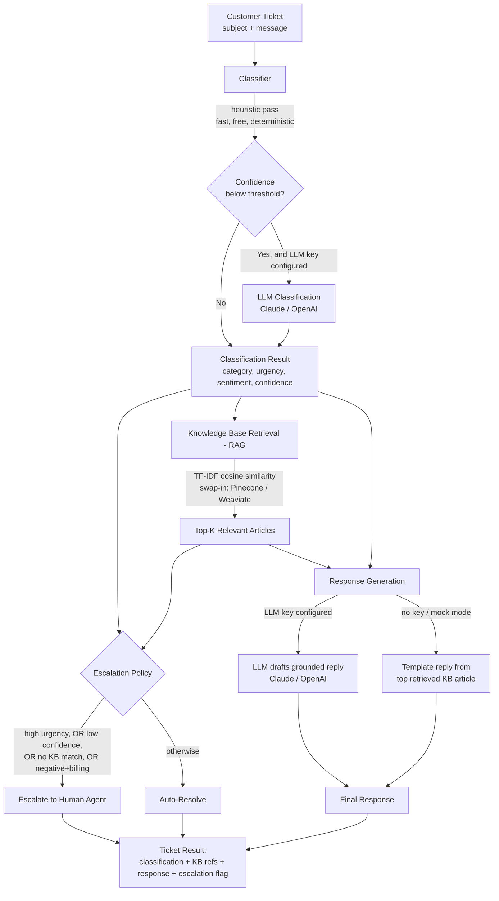

# System Architecture

## Overview Diagram

## Components

### 1. Classifier (`app/classifier.py`)
A hybrid classifier: a deterministic keyword/heuristic pass runs first (free,
instant, no external dependency). Only when that pass reports low confidence
*and* an LLM provider is actually configured does the system escalate the
classification decision to an LLM call. This mirrors the real production
pattern of using cheap rules for the easy majority of cases and reserving
model calls for ambiguous cases.

### 2. Knowledge Base / RAG (`app/rag.py`)
Markdown files in `data/knowledge_base/` are parsed and indexed with a
TF-IDF vectorizer at startup. Retrieval is cosine similarity over that index.
This is intentionally dependency-light (no vector DB, no model downloads) so
the whole repo runs instantly, offline, for any reviewer. The
`KnowledgeBase.search()` method is the single interface boundary — swapping
in Pinecone/Weaviate/Chroma with real embeddings later is a localized change.

### 3. LLM Client (`app/llm_client.py`)
A tiny provider-agnostic interface (`generate(prompt) -> str`) with concrete
implementations for Anthropic and OpenAI. The rest of the app never imports
the Anthropic or OpenAI SDKs directly — it only talks to this interface. This
is the extension point for adding Gemini, a local Ollama model, etc.

### 4. Agent Orchestrator (`app/agent.py`)
The multi-step decision-maker: classify → retrieve → decide escalate/auto →
generate. The escalation decision is its own small rule-based policy,
separated from both classification and generation so it can be tuned
independently (e.g. a business might want ALL billing complaints escalated
regardless of sentiment — that's a one-line change here, isolated from the
rest of the pipeline).

### 5. API Layer (`app/main.py`)
A FastAPI app exposing:
- `POST /api/ticket/process` — run the full pipeline on one ticket
- `GET /api/tickets/sample` — bundled sample dataset for demos
- `GET /api/kb` — list indexed knowledge base articles
- `GET /health` — reports which LLM provider and embedding backend are active
- `GET /` — serves a small interactive dashboard (`static/index.html`)

### 6. CLI Demo (`scripts/demo.py`)
Runs the entire pipeline over the bundled sample tickets from the terminal,
with colorized output — the fastest way to prove the system works end-to-end
without starting a server, and what the demo video is built around.

## Data Flow Example

1. Ticket arrives: *"I was charged twice for my order, please refund me. This is urgent."*
2. Heuristic classifier matches `billing` keywords with high confidence, `high` urgency (from "urgent"), `negative` sentiment.
3. RAG retrieves `Duplicate or Incorrect Charges` and `Refund Policy and Timelines`.
4. Escalation policy fires on `urgency == high` → routes to human.
5. Response generator still drafts a grounded reply (so the human agent has a starting point), citing the retrieved policy.
6. API returns the full structured result to the caller (or the dashboard renders it).

## Why This Shape Scales

- **Stateless API layer** → horizontally scalable behind a load balancer with no code changes.
- **Pluggable embedding & LLM backends** → cost/quality trade-offs are a config change, not a redeploy of new code paths.
- **Escalation logic isolated from classification/generation** → business rules can evolve independently of the ML components.
- **KB as flat files today, vector DB tomorrow** → the ingestion path (`_parse_markdown_kb`) is decoupled from the search interface, so migrating from files to a CMS-backed KB or a managed vector store touches one module.
